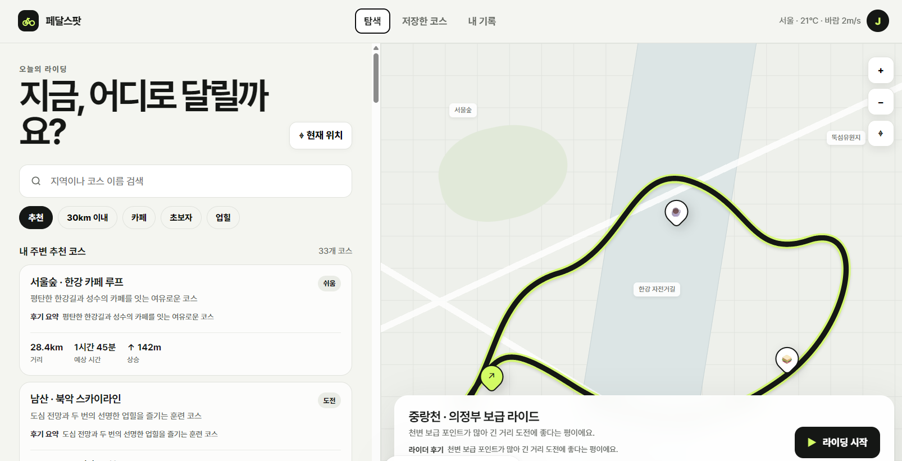

# 페달스팟 (PedalSpot)

현재 위치를 바탕으로 라이딩 코스를 탐색하고, 코스 위의 카페·식당·보급 지점을 함께 확인하는 자전거 라이딩 탐험 웹앱입니다.

## 이번 작업 주요 내용

- 추천 코스를 33개로 확장했습니다. 한강, 팔당, 북한강, 아라뱃길, 탄천, 중랑천, 남산·북악, 가평·춘천 등 거리와 난이도가 다른 코스를 제공합니다.
- 코스 카드와 상세 패널에 라이더 후기 요약을 추가했습니다. 평지 비율, 풍경, 보급 편의성, 업힐 강도처럼 라이더가 실제 선택에 활용할 수 있는 정보를 중심으로 구성했습니다.
- 실제 지도 타일과 브라우저 GPS를 연결했습니다. `현재 위치` 버튼을 누르면 위치 권한을 요청하고 현재 위치를 지도에 표시합니다.
- 추천 코스를 클릭하면 지도 경로와 함께 후기 기반 카페, 보급, 식사 스팟을 표시합니다. 각 마커에서 추천 이유와 해당 코스의 후기 요약을 확인할 수 있습니다.
- 라이딩 시작, 음성 안내 토글, 일시정지·종료, 지도 확대·축소 등 프로토타입의 핵심 상호작용을 유지했습니다.

## 오류 수정 사항

- 정적인 예시 지도만 보이던 문제를 수정해 공개 지도 타일을 렌더링하도록 변경했습니다.
- 현재 위치 버튼이 고정된 안내 문구만 표시하던 동작을 수정해, 실제 브라우저 위치 권한 요청과 지도 중심 이동을 수행하게 했습니다.
- 코스를 바꿔도 지도와 상세 정보가 이전 코스에 머무를 수 있던 흐름을 수정했습니다. 코스 선택 시 상세 정보, 지도 경로, 후기 기반 스팟이 함께 갱신됩니다.
- 확대·축소 버튼이 예시 배경만 조작하던 문제를 실제 지도 컨트롤과 연결해 수정했습니다.
- 코스 수가 늘어난 뒤 검색 및 필터 결과 수가 실제 목록과 일치하도록 렌더링 로직을 정비했습니다.

## 실행 방법

정적 웹앱이므로 `dist/index.html`을 브라우저에서 열거나 정적 파일 서버로 `dist/`를 제공하면 됩니다.

GPS 기능은 HTTPS 환경과 사용자 위치 권한이 필요합니다. 지도는 OpenStreetMap 타일과 Leaflet을 사용합니다.

## 프로젝트 구조

```text
dist/
  index.html       # 앱 UI, 추천 코스·후기 데이터, GPS·지도 동작
docs/images/
  pedalspot-dashboard.png
.openai/
  hosting.json     # 배포 설정
```
